 encoding: utf-8 

 Como establecer una relacion maestro detalle entre dos tablas 

En este documento se describe el proceso para definir una relación **maestro-detalle** entre dos 
tablas. Este tipo de relación puede verse desde dos puntos de vista, 
desde la tabla *maestra*, viendola como una relación *uno a muchos*, o desde la tabla 
de *detalle*, y la veremos como una relación *uno a uno*. En la descripcion utilizaremos
las tablas **bracket** y **vertical_signal** para ilustrar como definir la relación. 
La primera, *bracket* representa a la entidad de los soportes o postes de una señal de tráfico, 
y la segunda *vertical_signal*, representa a la entidad de las placas de una señal de tráfico. 
Entre ambas entidades existe una relacion de tipo **maestro-detalle**. 
En un poste pueden haber varias placas, *uno a muchos*, y una placa esta en un solo poste, *uno a uno*.
De ahora en adelante nos referiremos a estas dos entidades, como **bracket** y **vertical_signal**, que
son los nombres que tienen nuestras tablas.

A la hora de materializar en un modelo fisico este tipo de relacion entre entidades, es decir al crear nuestras tablas,
normalmente implicara que en la tabla de *detalle* exista un campo que referencie de
forma única a la tabla *maestro*. A este campo se le denomina **clave ajena**. En nuestro ejemplo, en la
tabla **vertical_signal**, tendremos un campo **bracket** que contendra el valor del campo **id** de la 
tabla **bracket**, siendo este campo el que establece la relacion entre las dos tablas.

Para establecer la relación *maestro-detalle* entre tablas mediante una *clave ajena*, en primer 
vamos a definir, la relación existente desde el punto de vista de la tabla de *detalle*, 
que la veremos como una relacion *uno a uno*. 

En primer lugar hay que *abrir las tablas* y el 
*gestor de columnas* asociado a estas. Para abrir las tablas hay que realizarlo desde 
el ***Gestor de proyectos*** situado en el menú ***Mostrar*** de *gvSIG Desktop*. 
El proceso de abrirlas es el genérico a abrir cualquier archivo, primero se selecciona 
***Tabla*** como tipo de datos a  abrir, se selecciona la opción de ***Nuevo***, lo 
que habilita una ventana donde se selecciona la pestaña ***Archivo*** y tras pulsar el 
botón ***Añadir***, se despliega un cuadro de diálogo donde se selecciona el fichero en 
cuestión. Tras la selección de este la tabla se muestra en una ventana. La 
siguiente ilustración muestra las tablas con las que se va a realizar el proceso. 

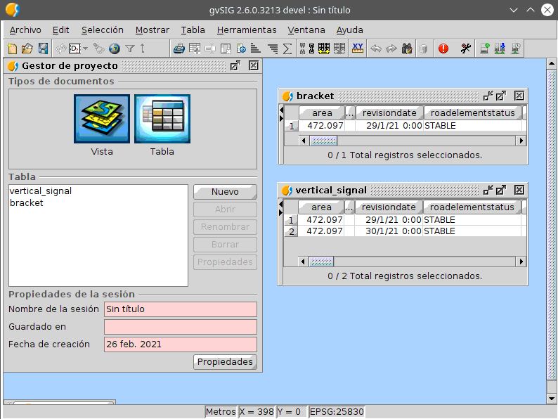

La *tabla bracket* tiene un único registro, mientra que la *tabla vertical_signal* 
presenta dos registros de dos señales, las cuales se sabe que están en el poste de la tabla 
anterior. Como en este momento vamos a definir la relacion desde un punto de vista de la 
tabla *detalle*, *uno a uno*, abriremos el *gestor de columnas* de la tabla que presenta papel
en la relación, *vertical_signal*, ya que una señal esta asociada solo a un poste.

Para obtener el gestor de esta hay seleccionar la tabla en cuestión y ejecutar el comando 
***Gestor de columnas*** situado en el menú ***Tabla*** de *gvSIG Desktop* siempre y cuando
la tabla este abierta. 

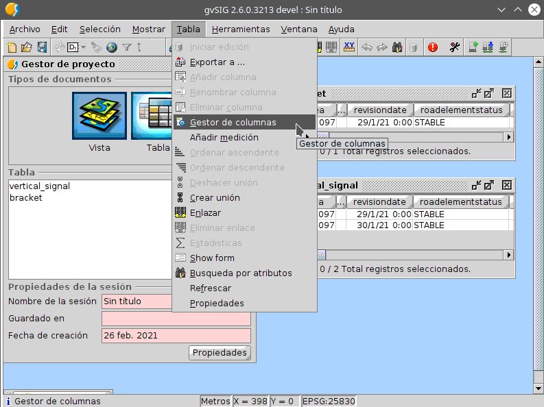

Como resultado se obtiene el siguiente gestor, *gestor de columnas* de la *tabla vertical_signal*.


Esta herramienta permite al usuario definir la estructura de datos de la tabla, 
así como su representación o visualización. La realización de los cambios se lleva 
a cabo por columnas y permite modificar estas, crear otras nuevas e incluso eliminarlas
si es necesario.

Como se busca definir una relación entre las dos tablas hay que buscar el campo que referencia a la 
tabla *bracket* dentro de la tabla *vertical_signal*, la *clave ajena*. En este caso se trata del 
campo *bracket*. Para establecer la relación hay que seleccionar en la ventana de 
*gestor de columnas* de la *tabla vertical_signal* dicho campo, *bracket*.


Una vez seleccionado se inicia su modificación pulsando el botón ***Modificar*** 
situado en la zona derecha de la ventana.

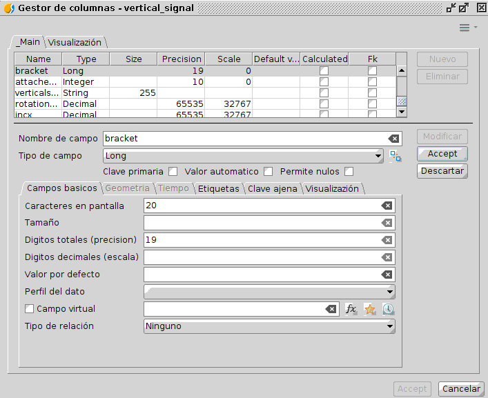

Tras lo anterior se habilitan una serie de pestañas en el panel inferior que permiten 
modificar todo lo referentes a los datos y la representación del campo. Para establecer
la relación hay que modificar el contenido de dos pestañas, la pestaña ***Campos básicos*** 
y la pestaña ***Clave ajena***.

La configuración comienza especificando en la pestaña ***Campos básicos*** el tipo de relación 
que presenta el campo en cuestión.

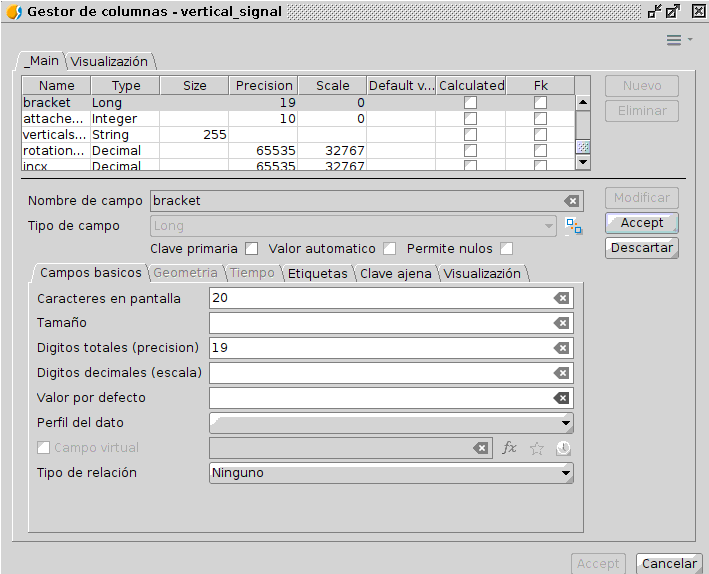

Los tipos de relación presentes en el desplegable **Tipo de relación** son:
 * **Ninguna.**
 * **Identidad (1:1).** Se utiliza para relacionar tablas que hacen referencia a 
 un mismo objeto. Este, sea por el motivo que sea, tiene distribuida la información
 en diferentes tablas.
 * **Colaboración (1:1).** Se utiliza para relacionar tablas por un campo o columna 
 común. Las tablas representa información de entes diferentes que tiene relación entre si. 
 * **Composición (1:n).** Se utiliza para establecer relación entre un objeto o 
 elemento de una tabla y varios objetos o elementos de otra, con la salvedad de 
 que el grupo de elementos depende del objeto único. Un ejemplo fácil seria un 
 ticket de la compra, el listado de artículos no tiene sentido si no esta 
 asociado a un ticket.
 * **Agregado (1:n).** Se utiliza para establecer relación entre un objeto 
 o elemento de una tabla y varios objetos o elementos de otra. Se diferencia 
 del anterior en que el grupo de elementos puede subsistir sin necesidad del 
 elemento único. 

En este caso concreto estableceremos un relación entre tablas uno a uno, se
pasa de no tener relación alguna a *Colaboración (1:1)* ya que como se detalla
en el ejemplo una señal solo esta en un poste. 

 Tras o anterior se inicia la configuración de la pestaña ***Clave ajena***.
 
 
 
Esta configuración comienza seleccionando en primer lugar si el campo es *clave ajena*.
Tras esto hay definir si dicho campo es *clave ajena de una lista cerrada o no*. 
En nuestro caso, la tabla *bracket* no es una lista de valores cerrados.

 > La única diferencia entre marcar si es una lista cerrada o no es la representación
 de los valores de esta en el formulario de la tabla de la clave ajena, en este caso
 en el formulario de *vertical_signal*.

Una vez seleccionados o no los elementos anteriores hay que definir la tabla de la cual
el campo es clave ajena, así como el campo que queremos que muestre en el formulario a
traves de una formula para su representación o visualización.

Asignaremos los siguientes valores:
- La *tabla* sería ```bracket```
- El *campo* sería ```id```
- La *formula especificada* sería ```'Poste ' || id```.

 > La expresión, ```'Poste ' || id```, concatena la palabra *Poste* con el identificador 
 o campo *id* de poste asociado mediante los símbolos ```||```. Esta forma de representar
 el dato es estética, podría indicarse unicamente el campo *id* en la barra de texto y 
 funcionaria sin problemas.

La configuración de las pestañas se puede ver en la siguientes imagenes:


Tras lo anterior solo queda terminar la modificación del campo pulsando el botón *Aceptar* 
del margen derecho y terminar el proceso en el *Gestor de columnas* pulsando el 
botón *Aceptar* situado en la esquina inferior derecha de dicho cuadro de diálogo.

Para ver si los cambios se han realizado con éxito de manera sencilla se puede 
consultar el *formulario* de la tabla que acabamos de modificar. Para obtener 
el formulario de la tabla seleccionaremos la opción ***Show form*** situada en 
el menú ***Tabla*** de *gvSIG Desktop* siempre y cuando la tabla este abierta. 
 
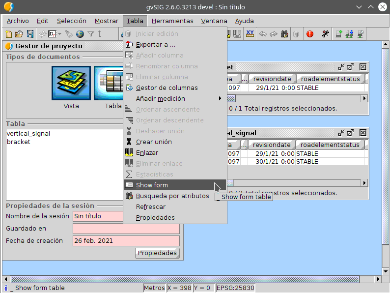

La siguiente ilustración muestra el formulario de la *tabla vertical_signal* antes 
de la relación (derecha) y tras la relación (izquierda).


Se puede aprecias que el campo *bracket* del formulario ha sufrido cambios. En el
formulario inicial era un campo sin más y en el formulario resultado de las 
modificaciones del gestor de columnas presenta una serie de componentes o 
botones que indican que esta ligado a otra tabla. 

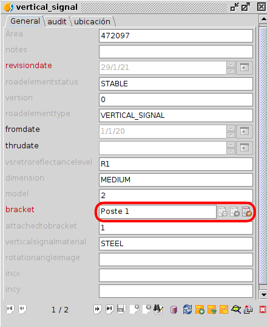 

Esos componentes son cuatro de izquierda a derecha:
* **Caja de texto con el elemento de la otra tabla seleccionado.** En el caso del 
ejemplo este cumple la expresión indicada anteriormente,  ```'Poste ' || id```.
* **Icono de selección de elemento.** Este está deshabilitado si la tabla no se 
encuentra en edición y permite seleccionar elementos de la tabla ligada.
* **Icono borrar elemento relacionado.**  Este está deshabilitado si la tabla 
no se encuentra en edición.
* **Icono ver elemento relacionado.** Nos permite visualizar el elemento 
relacionado de la tabla ligada en el formulario de esta.

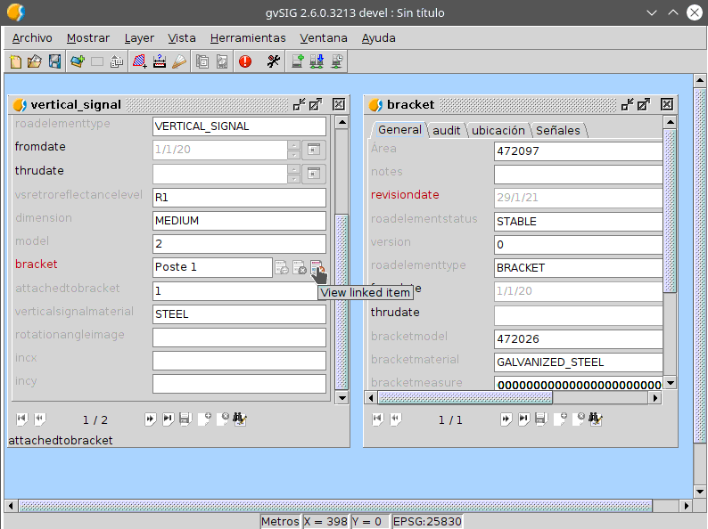

Realizado todo lo anterior se completa el proceso de ligar una tabla con 
otra mediante una relación uno a uno a traves de una clave ajena. 

Tras completar el apartado anterior y siguiendo el ejemplo, pasaremos a definir la relación
desde el punto de vista de la tabla *maestra*, es decir la tabla postes, relación de un elemento 
a varios de otra tabla. De esta forma tendríamos definida la relación entre las dos tablas 
en un sentido y otro.

Una vez en el *Gestor de columnas* de la *tabla bracket* se inicia el proceso con la creación 
de un nuevo campo. Para realizar esto hay que pulsar el botón ***Nuevo*** situado en 
el margen derecho de la ventana.

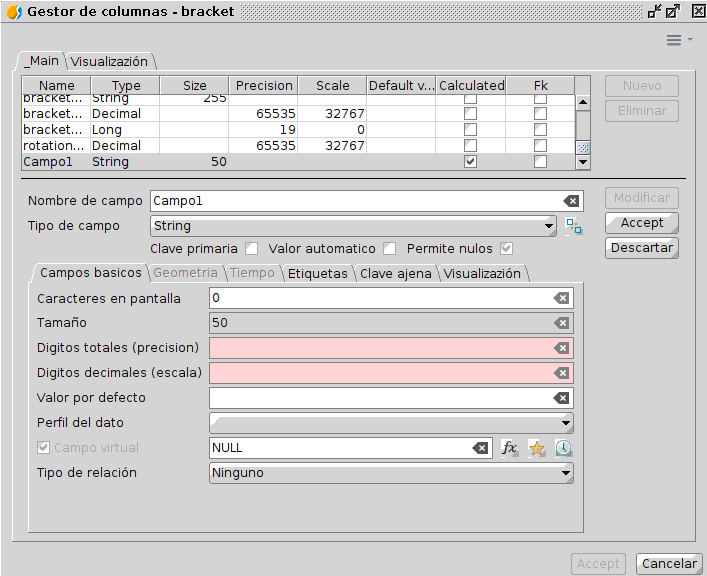

Como resultado de la ejecución y tal y como se muestra en la imagen anterior se crea un 
campo por defecto llamado *Campo1*, de tipo *String*, *tamaño 50*, *tipo de relación 
igual a ninguno*. El campo creado será un campo virtual, el cual hay que modificar su
definicion para crear la relacion. Las modificaciones a la definición de esteson las siguientes :
* El nombre del campo pasara a ser *Señales*.
* El tipo *lista*.
* En el tipo de relacion pondremos *Agregado (1:n)*.
* Y en *campo virtual* pondremos la expresión ```SELECT * FROM vertical_signal WHERE 
vertical_signal.bracket=id;```

 > La expresión, ```SELECT * FROM vertical_signal WHERE vertical_signal.bracket=id;```, 
 devolvera todos los elementos de la tabla *vertical_signal* donde el valor de su 
 columna *bracket* coincida con el valor del campo *id* de la /tabla bracket*.

Todos los valores anteriores pueden detallarse en la pestaña ***Campos básicos***. 
Concretamente el nombre *Señales* se puede definir en el cuadro de texto
***Nombre de campo***, el tipo de campo se detalla en el desplegable 
***Tipo de Campo o el icono adyacente a este*** que ofrece una mayor 
colección de tipo de datos. El tipo de relación se detalla en el ultimo 
desplegable de la pestaña llamado ***Tipo de relación***. Por último 
el que sea un campo calculado se especifica seleccionando el check 
***Campo virtual*** situada sobre el desplegable anterior y la fórmula 
se introduce en el cuadro adyacente a ese check. Si la tabla no se encuentra 
en edicion, solo se podran crear campos virtuales, estando el check marcado 
por defecto y no pudiendo desmarcarse. La fórmula puede introducirse de manera 
manual o mediante el evaluador de expresiones.

Como resultado de la creación y modificación del nuevo campo señales, 
la ventana del Gestor de columnas presenta este aspecto.


Tras modificar lo anterior aceptamos guardar los cambios sobre el ***campo señales**** l
o cual hace que este presente los parámetros correctos en la lista de campos del 
***Gestor de columnas***.


Una vez eso solo queda terminar los procesos en el *Gestor de columnas* pulsando 
el botón ***Aceptar*** situado en la esquina inferior derecha de dicha ventana.

Para el resultado de lo que acabamos de hacer podemos visualizar la *tabla bracket* o el *formulario asociado a ella*. En los dos elementos debe aparecer un nuevo campo llamado *Señales* relleno con una lista de valores que identifican las señales que presenta dicho poste.


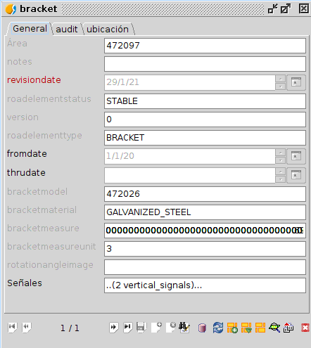

De este modo la relación se ha definido con éxito pero la visualización del grupo de 
elementos relacionados no es la deseada. Para mejorar dicha visualización hay que 
acudir de nuevo al *Gestor de columnas* de la tabla *bracket*, seleccionar la columna
*Señales* e iniciar la edición pulsando el botón ***Modificar***.

En esta ocasión hay que configurar dos pestañas, la pestaña ***Visualización*** 
y la pestaña ***Etiquetas***.

En la pestaña ***Visualización*** se especifica la *creación de un grupo* 
al cual llamamos *Señales*.


La creación de un grupo hace que el contenido de esa columna pase a visualizarse en una *pestaña nueva en el formulario*.

En la pestaña ***Etiquetas*** se establece la forma con la que se van a representar 
los elementos de la columna *Señales*. Para realizar la configuración hay que añadir 
al panel de dicha pestaña la siguiente serie de parámetros mediante el botón ***Añadir*** 
y ***Actualizar***. Esos parámetros son:
 * ***DAL.RelatedFeatures.Table***. Especifica la tabla de donde va obtener los valores 
 a representar para cada elemento de la columna señales.
 * ***DAL.RelatedFeatures.Unique.Field.Name***. Detalla el identificador único de 
 la tabla anterior.
 * ***DAL.RelatedFeatures.Columns***. Columnas de la tabla que guarda la información de 
 los elementos de la lista que se van a mostrar para los diferentes elementos 
 que se dan tras la relación. Especificar que el nombre de las columnas tiene 
 que ir separado por dos puntos ```':'```.
 * ***dynform.resizeweight***. Permite ajustar el tamaño de la zona donde se muestran 
 el grupo de elementos.

En el caso concreto del ejemplo que se esta realizando los valores de 
los parámetros anteriores son;

 * **DAL.RelatedFeatures.Table**  ```vertical_signal```
 * **DAL.RelatedFeatures.Unique.Field.Name** ```id```
 * **DAL.RelatedFeatures.Columns**  ```id:model:revisiondate```
 * **dynform.resizeweight** ```10```

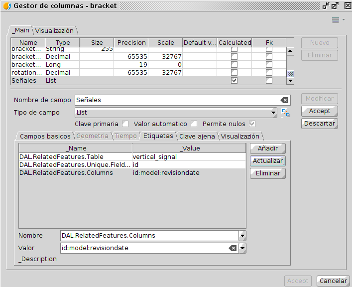

Una vez terminado lo anterior se termina la edición de la columna pulsando el 
botón ***Aceptar*** del margen derecho y terminar el proceso en el 
*Gestor de columnas* pulsando el botón ***Aceptar*** situado en la esquina 
inferior derecha de dicha ventana.

Como resultado de lo anterior podemos ver que el formulario de la *tabla bracket* 
ha cambiado con respecto al anterior. Tras las anteriores modificaciones realizadas
en el *Gestor de columnas* este ahora presenta en su margen superior una pestaña 
llamada *Señales*, la cual almacena las placas de señales que tiene el poste en 
cuestión mostrando el identificador, modelo y fecha de revisión de cada señal.

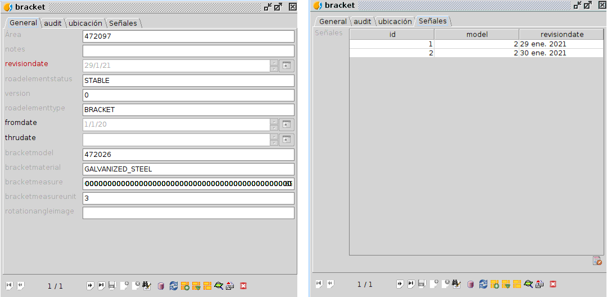

Para ver la información de cada señal en su formulario correspondiente solo hay 
que seleccionarla y pulsar el icono que hay bajo la lista.

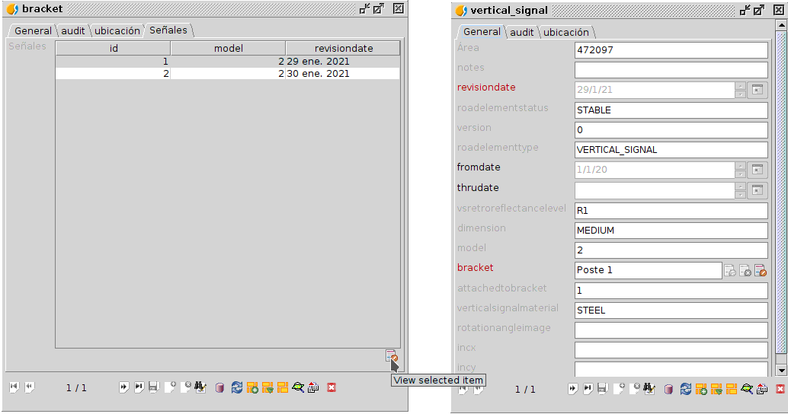
