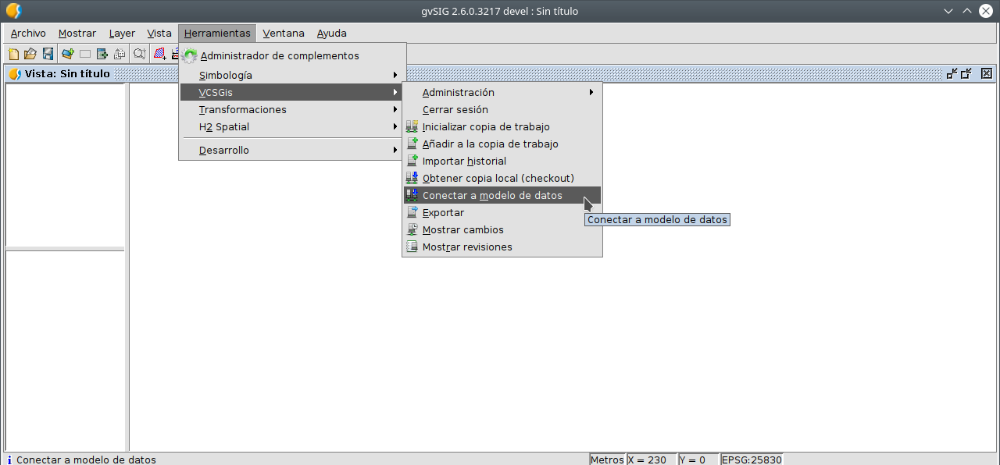
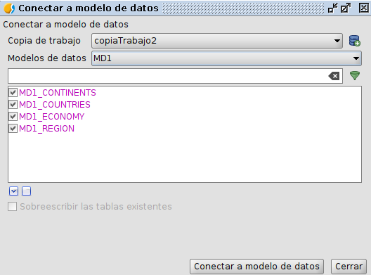

 encoding: utf-8 
 Conexion modelo  

Una vez definido y cargado en el repositorio un modelo de datos, se sigue el flujo de trabajo 
habitual con *VCSGis*. Crear una copia de trabajo y dercargar en ellas las tablas con las 
que se busca trabajar. Ahora bien, se dispondrá de una herramienta que permite "conectar" 
a un modelo de datos. Esta herramienta presenta para una copia local determinada cuales son los 
modelos de datos que hay definidos en ella pudiendo seleccionar uno. Tras la selección se muestran las 
tablas que componen dicho modelo de datos, y si tras conectarse a el, se descargará las tablas 
del modelo y las registrará para que *gvSIG Desktop* pueda acceder a ellas aunque no esten cargadas 
como tablas o capas del proyecto actual.

Dicha herramienta se encuentra en el menú *Herramientas*, *submenú VCSGis*, opción *Conectar a modelo 
de datos*.

Esa opción despliega el siguiente cuadro de diálogo en cual tras seleccionar una copia de trabajo y el modelo
de datos, nos descarga en esta las capas que conforman dicho modelo.

La siguiente ilustración muestra la ventana que tras pulsar el botón *Conectar a modelo de datos* cargará
en la nueva copia de trabajo *copiaTrabajo2* las capas que conforman el modelo de datos *MD1*. La lista 
de capas puede verse en dicha ventana.

