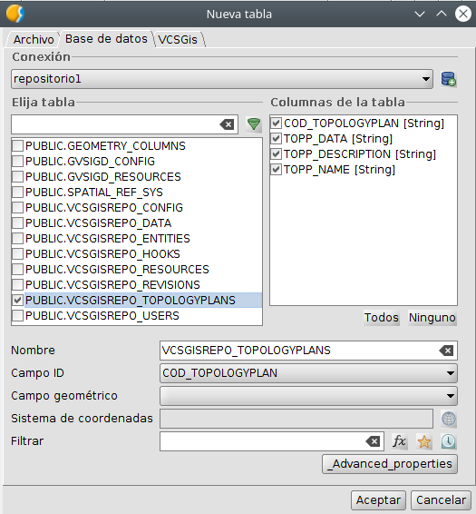
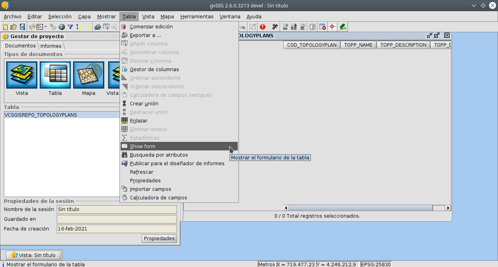
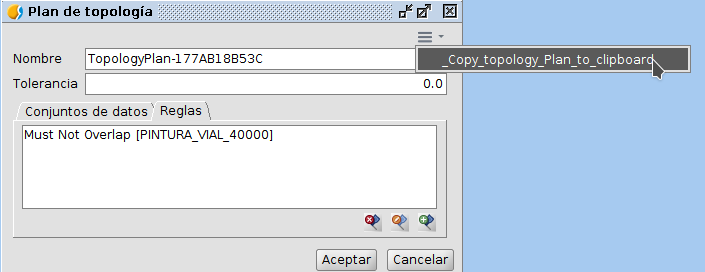
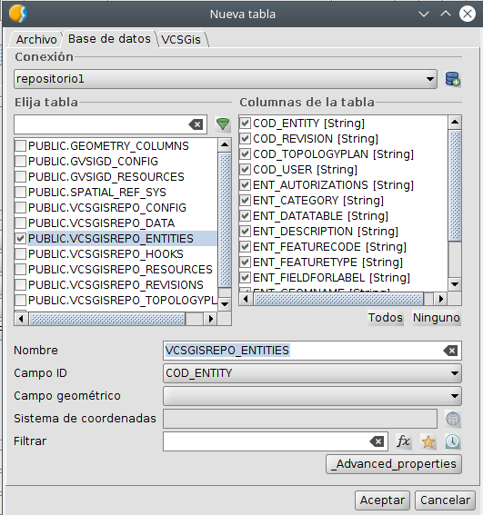
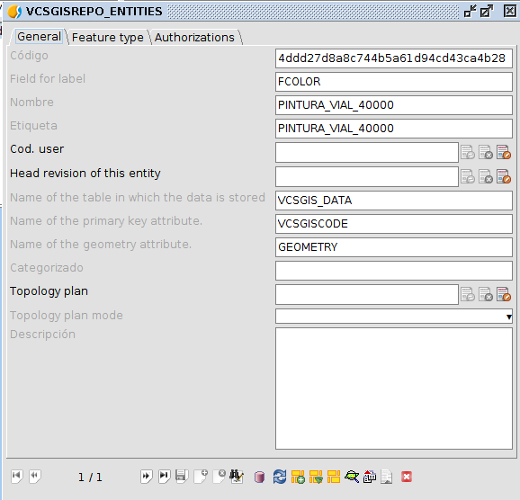

 encoding: utf-8 
 Topología en VCSGis  

El sistema de control de versiones *VCSGis* de *gvSIG Desktop* permite incluir revisiones topológicas a aplicar a la información que este maneja si el usuario lo desea. En otras palabras, garantiza que la información gráfica gestionada por el control de versiones cumpla las reglas topológicas especificadas por el usuario. Para realizar lo anterior hay que configurar varios aspectos del repositorio como son la tabla de planes topológicos y la tabla de entidades. 

Como se cita anteriormente la configuración topológica se realiza modificando varias tablas. En primer lugar hay que crear en la tabla de planes topológicos, **VCSGISREPO_TOPOLOGYPLANS**, una nueva entrada. La tabla originalmente aparece vacía y sin ningún elemento. Para acceder a ella hay que abrir la tabla desde el gestor de proyectos. 

Tras haber accedido a ella hay que ejecutar el comando Show form, el cual nos permite de forma cómoda crear un nuevo plan.

Como resultado de ejecutar el comando anterior se obtiene el siguiente formulario.

Para crear un nuevo plan solo tendremos que poner la tabla en edición,  crear un nuevo plan, rellenar la información del plan (Código, Nombre, Descripción y plan topológico en JSON), guardar dicho plan y terminar la edición de la tabla. Dicho proceso se detalla en la siguiente ilustración.

Para obtener la información sobre el plan topológico en formato JSON hay que crear este previamente mediante el plugin de *Topologia* de *gvSIG Desktop*.
Este se puede obtener en ese formato solo al pulsar el botón de opciones situado en la esquina superior derecha y seleccionar la opción *Copiar plan topológico al portapapeles*.

Esa cadena de carácteres es la información a incluir en la definición de un plan topológico de la tabla **VCSGISREPO_TOPOLOGYPLANS**.

La siguiente ilustración muestra la tabla con el registro correspondiente al plan topológico creado en el ejemplo.

Tras la creación de una nueva entrada en la tabla de planes topológicos, solo queda asignar ese plan a las tablas del repositorio sobre las cuales se busca que cumplan topología. Para realizar lo anterior hay que abrir la tabla **VCSGISREPO_ENTITIES** donde se almacenan las capas/tablas disponibles en el repositorio. El acceso a esta tabla se realiza de igual manera que la anterior.

En la siguiente imagen se muestra que la tabla de entidades del repositorio ejemplo solo almacena una capa. Com se puede apreciar no presenta ningún plan de topología asociado.

Una vez allí hay que obtener su formulario asociado al igual que con la tabla de planes topológicos mediante ella ejecución del comando *Show form*. Una vez desplegado, en el formulario aparecen todas las tablas disponibles del repositorio, las cuales mediante edición permite asignar un plan de topología definidos anteriormente en la tabla correspondiente.

La edición del formulario se realiza de la misma manera que en el formulario de planes topológicos. Durate la edición de la entidad hay que asignar el plan correspondiente a la tabla en la pestaña *General*, desplegable *Plan Topológico*.

