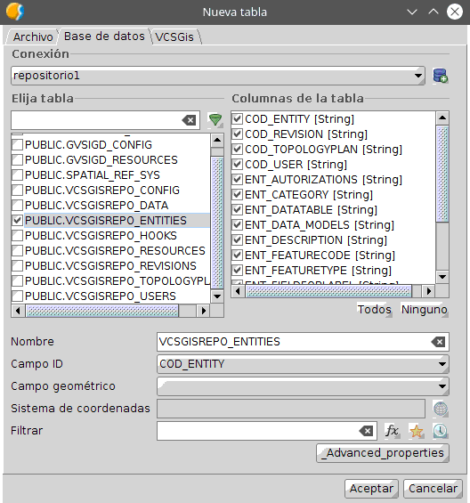
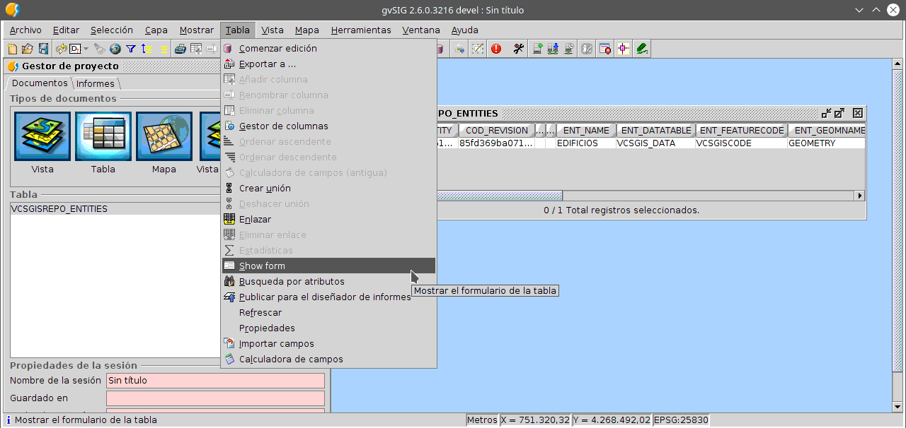
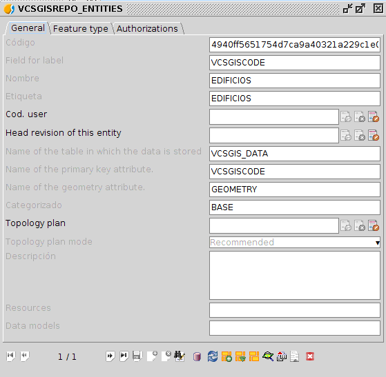
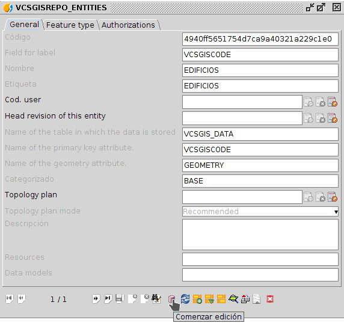
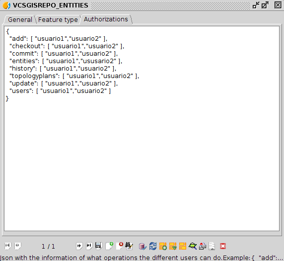
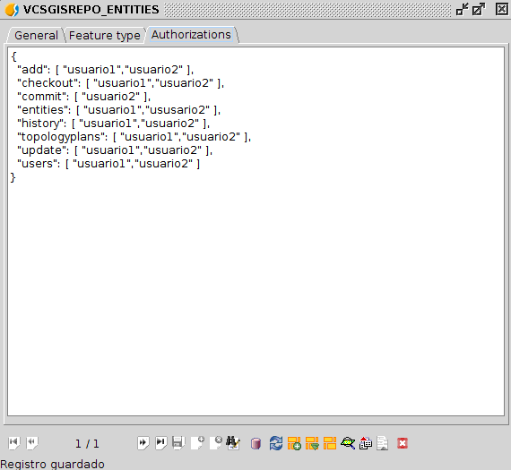
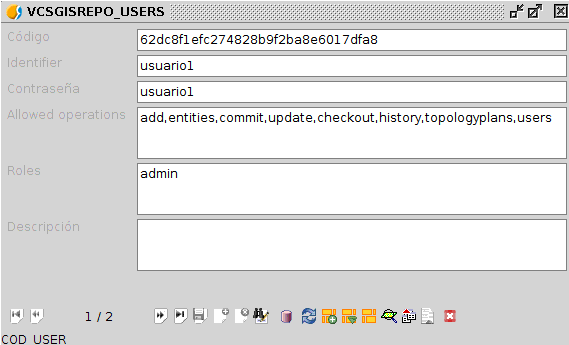

 encoding: utf-8 
 Introduccion  

**(en construccion)**

La autorización avanzada representa el mayor grado de seguridad ofrecido por la herramienta *VCSGis* de *gvSIG
Desktop*. Como se detalla anteriormente se basa en definir en el propio dato los usuarios y acciones autorizados a 
trabajar con este.

Para realizar dicha definición hay que realizar modificaciones sobre la tabla *PUBLIC.VCSGISREPO_ENTITIES*. Dicha
tabla lista los diferentes elementos registrados en el repositorio, es decir las capa/tablas. De modo que, sobre 
los elementos anteriores hay que definir que acciones pueden realizarse sobre la capa y quien puede llevarla a cabo.

Para abrir las tablas hay que realizarlo desde el *Gestor de proyectos* situado en el menú *Mostrar* de 
*gvSIG Desktop*. El proceso de abrir una tabla es el genérico a abrir cualquier archivo, primero se 
selecciona *Tabla* como tipo de datos a abrir, se selecciona la opción de *Nuevo*, lo que habilita una 
ventana donde se tiene que seleccionar la pestaña *Base de datos*. Esa pestaña muestra en su zona superior
un desplegable donde hay que especificar la base de datos donde se encuentra la tabla. 
Una vez seleccionada la base de datos, en la lista de tablas de esta hay que marcar la tabla 
en cuestión y pulsa el botón *Aceptar*.

A continuación se muestra la ventana con la que se abre la tabla *PUBLIC.VCSGISREPO_ENTITIES*.



La tabla anterior se muestra en la siguiente imagen.


El proceso de definición de acciones y usuarios por dato se realiza modificando elementos a esta tabla.
Para ello es necesario obtener el formulario asociado la capa *PUBLIC.VCSGISREPO_ENTITIES*. 
Para obtener el formulario de la tabla seleccionaremos la opción *Show form* situada en el menú 
*Tabla* de *gvSIG Desktop* siempre y cuando la tabla este abierta y seleccionada.



El formulario de la tabla es el siguiente.



Una vez en el formulario se inicia la edición de la tabla para la modificación del elemento. 
Este proceso se puede realizar desde el mismo desplegable que se mencionó anteriormente para obtener 
el formulario, o desde el mismo formulario utilizando el botón *Comenzar edición*.



De los diferentes elementos del formulario hay que seleccionar la pestaña *Authorization* la cual despliega un panel
sobre el cual hay que modificar un texto en formato ```Json``` el cual asigna a las diferentes acciones, los usuarios
que pueden realizarlas sobre dicha entidad o capa.


En el caso del ejemplo que se muestra en la siguiente imagen los usuarios *usuario1* y *usuario2*, creado previamente 
en los apartados anteriores, van a disponer de las posibilidad de  realizar todas las acciones sobre la capa 
seleccionada.



Solo queda guardar los cambios en la entidad.


Y terminar la edición de la tabla.


Tras lo anterior la entidad ha quedado configurada con la definición de acciones permitidas por usuario, pero 
es importante destacar que la definición propia de cada usuario se mantiene activa. De la frase anterior se deduce,
que el *usuario2* aún teniendo permitido el *commit* en la entidad configurada, no podrá realizarlo pues 
de base este no tiene permitida esa acción.

De igual manera pero en sentido contrario, si tras realizar todo lo anterior se configura que el *usuario1* no pueda
realizar *commit* sobre la entidad, por mucho que este presente la acción habilitada en su configuración de usuario no
podrá hacer *commit* sobre la entidad.



Si tras realizar cambios sobre una capa/tabla del repositorio sujeta al control de versiones este usuario
intenta subir dichos cambios locales al repositorio el sistema le mostrará la ventana para introducir credenciales.
Al identificarse como *usuario1* no lo permitirá mostrando la ventana del login hasta que se introduzca un usuario
y contraseña válido o se pulse el botón *Cancelar*, el cual muestra el siguiente cuadro de diálogo.


Además de lo anteriormente aplicado a la configuración de la autorización avanzada en *VCSGis*, la herramienta dispone
de la posibilidad de aplicar un sistema de roles en la gestión de usuarios. Un usuario puede presentar además de 
su identificador propio tantos roles como se deseen. Los roles se definen en la tabla *PUBLIC.VCSGISREPO_USERS* en 
cada usuario en su creación o modificándolos posteriormente.

Para añadir los roles hay que abrir la tabla y posteriormente el formulario asociado.


Una vez en el formulario se procede a crear un nuevo usuario o modificarlo siguiendo el siguiente flujo de trabajo;

 * Comenzar edición.
 * Nuevo elemento más rellenar campos del formulario o modificar campos del formulario.
 * Guardar cambios.
 * Terminar edición.

El campo en cuestión sobre el cual hay que asignar el rol o roles del usuario es el campo *roles*.

La siguiente ilustración muestra el ejemplo de un usuario editado con roles.



El *usuario1* presenta ahora el rol de administrador, *admin*.

Con esta nueva posibilidad la configuración del nivel de seguridad autorización avanzada ofrece una nueva posibilidad.
Esta nueva posibilidad no es otra que permitir en la definición de la acciones y usuarios permitidos para cada dato 
permitir no solo usuarios concretos, sino grupos de usuarios o roles.

Para hacer lo anterior solo hay que realizar la modificación de la entidad de igual manera que al inicio del apartado,
y en el panel de la pestaña *Authorization* del formulario de la tabla *PUBLIC.VCSGISREPO_ENTITIES* en las diferentes
acciones especificar también la palabra que identifique el rol con un símbolo ```$``` previo. La siguiente ilustración 
muestra dicho cuadro de diálogo para la entidad seleccionada incluyendo que todo miembro del rol *admin* 
pueda realizar la acción *commit*.


Tras lo anterior solo hay que guardar cambios en la entidad y terminar edición en la tabla. A partir de ese momento 
los usuarios con el rol *admim* pueden realizar *commits* en dicha entidad.


