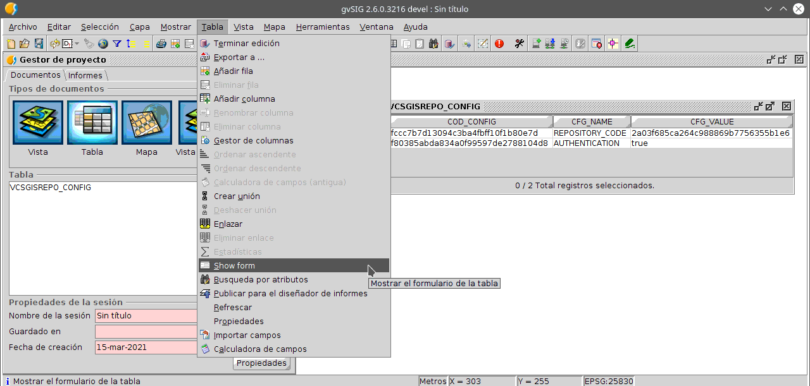
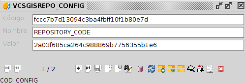
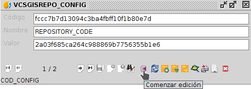

 encoding: utf-8 
 Introduccion  

**(en construccion)**

Activar el proceso de autorización se realiza de igual manera que al activar el proceso de autenticación, es decir,
realizando modificaciones sobre la tabla *PUBLIC.VCSGISREPO_CONFIG*.

Para abrir dicha tabla hay que realizarlo desde el *Gestor de proyectos* situado en el menú *Mostrar* de 
*gvSIG Desktop*. El proceso de abrir una tabla es el genérico a abrir cualquier archivo, primero se 
selecciona *Tabla* como tipo de datos a abrir, se selecciona la opción de *Nuevo*, lo que habilita una 
ventana donde se tiene que seleccionar la pestaña *Base de datos*. Esa pestaña muestra en su zona superior
un desplegable donde hay que especificar la base de datos donde se encuentra la tabla. 
Una vez seleccionada la base de datos, en la lista de tablas de esta hay que marcar la tabla 
en cuestión y pulsa el botón *Aceptar*.

A continuación se muestra la ventana con la que se abre la tabla *PUBLIC.VCSGISREPO_CONFIG*.

La tabla anterior se muestra en la siguiente imagen.

Para dotar a este repositorio ejemplo de este nivel de seguridad solo hay que registrar un nuevo elemento en
dicha tabla. Lo anterior puede realizarse mediante el formulario asociado la tabla. 
Para obtener el formulario de la tabla seleccionaremos la opción *Show form* situada en el menú 
*Tabla* de *gvSIG Desktop* siempre y cuando la tabla este abierta y seleccionada.

El formulario de la tabla es el siguiente.

Una vez en el formulario se inicia la edición de la tabla para creación de un nuevo elemento. 
Este proceso se puede realizar desde el mismo desplegable que se mencionó anteriormente para obtener 
el formulario, o desde el mismo formulario utilizando el botón *Comenzar edición*.

De los diferentes campos del formulario hay que identificar los campos *nombre* y *valor*. En el primero hay que 
especificar **AUTHENTICATION** y en el segundo **true**.

Solo queda guardar los cambios en la entidad.

Y terminar la edición de la tabla.

Con lo anterior ya se disponde del nivel de seguridad autorización aplicado en el repositorio. Especificar que no
existe un nivel de auterización básica o avanzada como tal sino que solo existe el nivel de autorización. Esta forma
de dividir en dos apartados la autorización se debe a que se puede aplicar la autorización de dos maneras diferentes
siendo una más restrictiva que la otra.

> * Activar la autorizacion
> * Operaciones
> * Autorizar operaciones por usuario
> * no autorizar a commit y probar.
