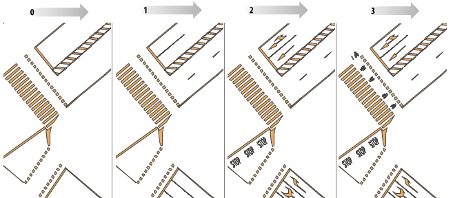

 encoding: utf-8 
 Revisiones  

Volviendo al proceso de publicar o *confirmar* los datos en el servidor, hacer *commit*, este nos genera como resultado una **revisión** a la cual esta ligada cualquier cambio realizado en la tabla de la copia de trabajo modificada; cambiar el contenido de las tablas, crear, borrar, renombrar y copiar registros o geometrias… Siendo solo registrada en el repositorio si todos los cambios de esa tabla pueden realizarse (transacción atómica). En el caso de que algún cambio de una tabla no pueda hacerse, ninguno de los demás cambios de la tabla referentes a esa revisión se realizará. Las revisiones presentan un identificador único de la revisión y en el caso de VCSGis cada tabla de la copia de trabajo presentara un control de la revisión individual con identificadores únicos propios.

Para ilustrar lo anterior se presenta el siguiente esquema del funcionamiento de las revisiones;

En la primera revisión, revisión 0, se han creado las lineas base de la calzada, en la siguiente revisión, revisión 1, se añaden las separaciones entre carriles y medaneras, en la revisión 2 se añaden las feclas indicadores del sentido y señales de stop, y por ultimo, en la revisión número 3 se han añadido las señales del carril bici.

Tras la explicación anterior parece lógico pensar que las revisiones y su número o identificador único son el mecanismo que utilizan los sistemas de control de versiones y por tanto *VCSGis* para gestionar el estado de la copia de trabajo con respecto al repositorio y viceversa. 
