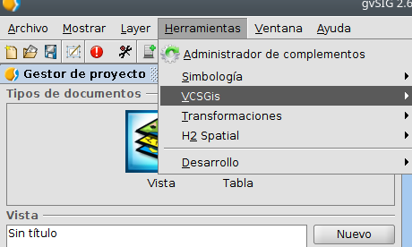

 encoding: utf-8 
 Conceptos básicos  

Antes de que entremos a ver como funciona *VCSGis* es importante tener una visión 
general de cómo funciona un *Sistema de Control de Version* (*VCS*) y los términos 
que se utilizan.

* El **repositorio**
  VCSGis usa una base de datos central que contiene todos los datos cuyas versiones 
  se controlan y sus respectivas historias. Ésta base de datos se conoce como 
  el **repositorio**. El repositorio normalmente esta en un servidor de base de datos, 
  que provee a pedido el contenido a los clientes de *VCSGis*. Si solo puede hacer 
  una copia de seguridad de una sola cosa, hágala del repositorio, ya que es la 
  copia maestra de toda su información.
  
* **Copia de trabajo**

    Aquí es donde se realiza el trabajo en serio. Cada usuario tiene su propia 
    copia de trabajo, comunemente conocida como *caja de arena* en su ordenador 
    local. Usted puede obtener la última versión del *repositorio*, trabajar en 
    ella localmente sin perjudicar a nadie, y cuando haya terminado con los 
    cambios que ha realizado puede *confirmar* (commit) sus cambios en 
    el *repositorio*.

    Una *copia de trabajo* de *VCSGis* no contiene la historia de los datos, 
    pero sí contiene una copia de los datos que existían en el repositorio antes 
    que comience a hacer cambios. Esto significa que es fácil verificar qué 
    cambios ha realizado.

También necesita saber donde encontrar *VCSGis* dado que no hay mucho para 
ver en los menus y herramientas de *gvSIG desktop*. Esto se debe a que *VCSGis* 
es una complemento de *gvSIG desktop*, así que primero inicie el *gvSIG dektop*. 
Hága click en el menu *"Herramientas"* y debería ver una entrada nueva **VCSGis**:

  
