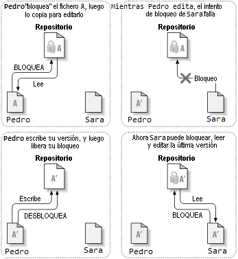

 encoding: utf-8 
 Bloquear-Modificar-Bloquear  

Muchos sistemas de control de versiones utilizan un modelo Bloquear-Modificar-Desbloquear para enfrentarse al problema anterior, lo cual es una solución muy simple. En estos sistemas, el repositorio sólo permite que una persona cambie un archivo. Pedro primero debe bloquear el archivo antes que pueda empezar a hacer cambios en él. Si Pedro ha bloqueado un archivo, entonces Sara no puede hacer ningún cambio en él. Si ella intenta bloquear el archivo, el repositorio le denegará la petición. Todo lo que ella puede hacer es leer el archivo, y esperar a que Pedro termine sus cambios y libere el bloqueo. Después que Pedro desbloquee el archivo es el turno de Sara para bloquear y editar.

El problema con el modelo bloquear-modificar-desbloquear es que es un poco restrictivo, y a menudo se convierte en una molestia para los usuarios:

 * *El bloqueo causa muchos problemas administrativos*. A veces los usuarios bloquean archivos y se olvidan de desbloquearlos, dejando sin acceso a la edición de estos por parte de los demás usuarios. Para solucionar esto se tiene que gestionar el desbloqueo por parte de un administrador lo cual hace que la situación cause un montón de retraso y pérdidas de tiempo innecesarias.

 * *El bloqueo puede causar procesos en serie innecesarios*. ¿Qué ocurre si un usuario está editando el inicio de un archivo de texto, y otro simplemente quiere cambiar la parte final del mismo archivo? Esos cambios no se superponen en absoluto y por tanto se podría editar el archivo de forma simultánea, no existiendo la necesidad de tomar turnos en este tipo de situaciones.

 * *El bloqueo puede causar una falsa sensación de seguridad*. Imagine que un usuario bloquea y edita el archivo A, mientras otro usuario distinto simultáneamente bloquea y edita el archivo B. Pero supongamos también que  los archivos A y B dependen uno del otro, y que los cambios hechos a cada uno son incompatibles. De repente A y B ya no funcionan juntos y el sistema de bloqueo no tiene forma de prevenir este problema, sin embargo, de alguna forma este sistema dio una sensación de falsa seguridad. Es fácil para los usuarios imaginar que al bloquear los archivos están realizando una tarea segura y aislada, y la realidad es que no, inhibiendoles de discutir si sus cambios son compatibles entre si.

